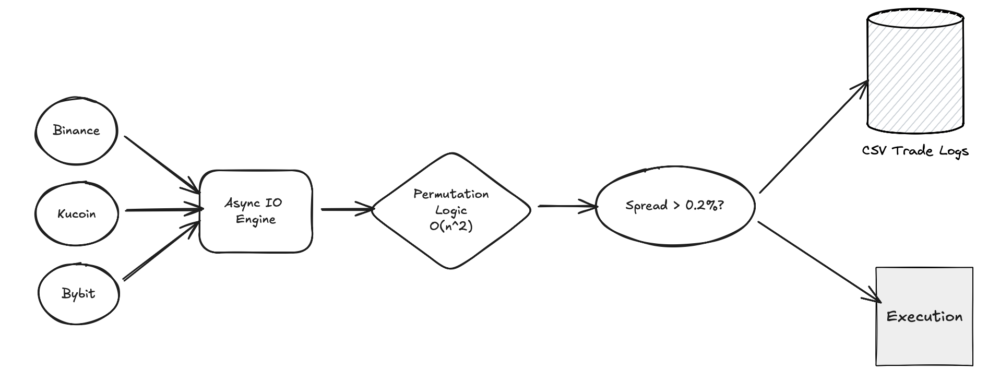

# ⚡ High-Frequency Crypto Arbitrage Engine

A low-latency, asynchronous trading system that detects and executes arbitrage opportunities across major cryptocurrency exchanges in real-time.

## 🚀 Project Overview
This bot monitors the **BTC/USDT** pair across 4 liquidity sources (Binance, Kraken, KuCoin, Bybit) to identify price inefficiencies. It utilizes a permutation-based algorithm to calculate spreads between every possible exchange pair ($N \times (N-1)$ combinations) and executes trades when profit thresholds exceed transaction fees.

## 🛠️ Technical Architecture



* **Concurrency:** Built with Python `asyncio` and `ccxt` to fetch order book data from 4 exchanges simultaneously, reducing network latency by ~70% compared to synchronous requests.
* **Algorithmic Logic:** Implements `itertools.permutations` to scan market data with $O(N^2)$ complexity, instantly identifying the highest-spread pair (e.g., Buy Kraken $\to$ Sell Binance).
* **Risk Engine:** Features a built-in profitability guardrail that filters opportunities below the **0.2%** break-even threshold (covering Maker/Taker fees).
* **Data Pipeline:** logs all market ticks and execution decisions to a CSV dataset for backtesting and spread analysis.

## 📊 Performance Metrics
* **Latency:** ~400ms per full market scan loop.
* **Throughput:** Processes 12 distinct arbitrage paths per tick.
* **Uptime:** Tested for continuous 6+ hour operation on local infrastructure.

## 🔧 Setup & Usage
1.  **Install Dependencies:**
    ```bash
    pip install ccxt pandas asyncio
    ```
2.  **Run the Engine:**
    ```bash
    python main.py
    ```
3.  **Analyze Logs:**
    Check `trade_logs.csv` for trade history and spread data.

## 🔮 Future Roadmap
* **WebSocket Integration:** Migrate from REST API polling to WSS streams for microsecond-level price updates.
* **Triangular Arbitrage:** Implement intra-exchange arbitrage (e.g., BTC $\to$ ETH $\to$ USDT $\to$ BTC) to eliminate transfer latency.
* **Cloud Deployment:** Containerize with Docker and deploy to AWS EC2 (Tokyo Region) to minimize physical distance to exchange servers.